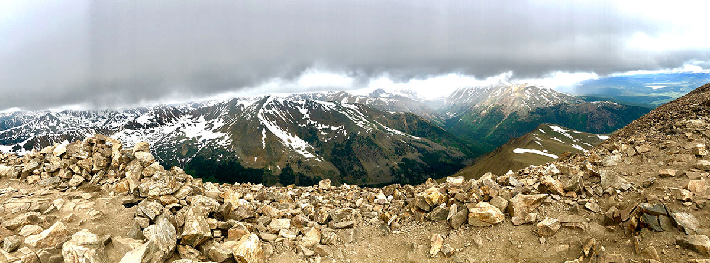

# demo-project
This repo is for demonstrating how to set up a project with branching

## Installation
There is no installation process required. Simply download the files to your computer.

## Usage
Open index.html in your browser of choice.

## Contributing
1. Fork it!
2. Create your feature branch: `git checkout -b my-new-feature`
3. Commit your changes: `git commit -am 'Add some feature'`
4. Push to the branch: `git push origin my-new-feature`
5. Submit a pull request :D

## History
TODO: Write history

## Credits
Marco De Luca

## License
MIT - See included license file.